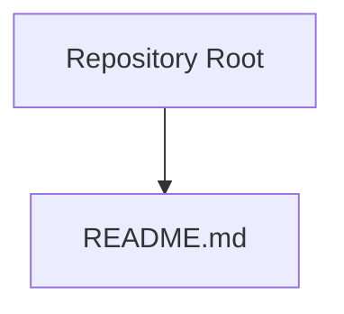

# GROCEREZ

A Flask + VueJS + SQLite + Celery + Redis Grocery Shopping Application

## Project Title & Description
GROCEREZ is a full stack grocery shopping application designed with a Flask backend, a Vue.js frontend, SQLite for storage, and Celery with Redis for asynchronous task processing. The project aims to streamline shopping workflows by providing a lightweight, responsive interface backed by a robust Python stack and a fast JavaScript frontend.

## Architecture Overview

> Note: The repository currently contains only README.md as its top level file. No additional directories or config files are present to illustrate a full architectural layout.

## Tech Stack
- Backend: Python with Flask
- Frontend: Vue.js
- Database: SQLite
- Asynchronous Processing: Celery
- Message Broker / Cache: Redis

No explicit configuration files were detected in this repository to document scripts or run commands. The tech stack is inferred from the project description.

## Getting Started / How to Run
- No configuration files were found in this repository to provide runnable commands or setup scripts.
- To run or build locally, you would typically need:
  - A Python environment with Flask and Celery dependencies
  - A Node.js environment for the Vue.js frontend
  - Redis running for Celery broker/backend
  - An SQLite database for persistent storage
- If you add configuration files (for example, requirements.txt, pyproject.toml, package.json, Dockerfile, Makefile, etc.), we will document the exact commands supported by those configs in this section.

## Project Structure
- Root directory currently contains:
  - README.md
- No other directories or source code files are detected in this repository. If you intend to add a Flask backend, a Vue.js frontend, Celery workers, or Docker setups, consider organizing them into conventional directories (for example, backend/, frontend/, celery_tasks/, docker/).

## Contributing
- Contributions are welcome. Please follow these guidelines:
  - Fork the repository and create a feature branch.
  - Write clear, concise commits describing the changes.
  - Open a pull request with a description of the changes and any tests or manual checks performed.
  - Ensure code formatting and linting guidelines are followed.
  - Add or update tests where applicable and provide instructions for running them.
- If there is no existing CONTRIBUTING.md, consider adding one to outline repository-specific contribution standards, testing requirements, and maintenance practices.

---

If you add actual configuration files or code, I can update this README to include concrete setup steps, run commands, and architectural details derived directly from the repo contents.